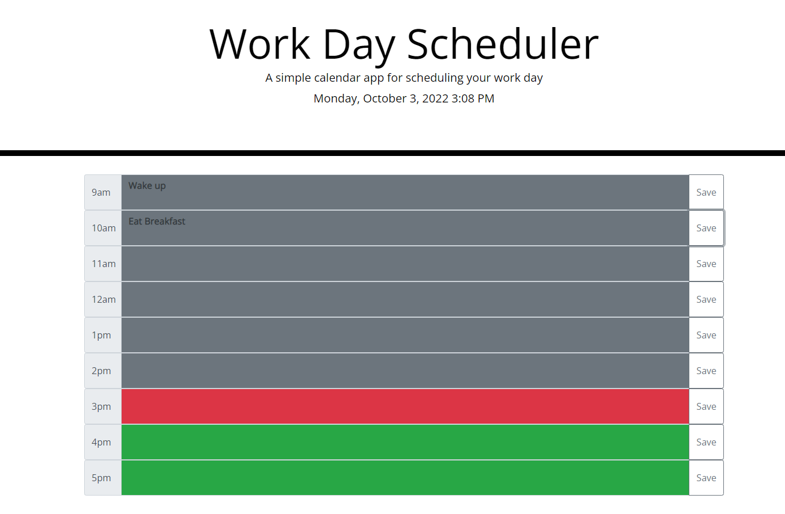

# Plan-a-Day
Workday Planner

## Description
User can input to-do list items into various forms for each hour of the work day. By clicking the save button, it will save that info on their local storage.

Url Link:
[Plan-a-day](https://themanamana.github.io/Plan-a-Day/)

## Important Concepts

-JQuery

-Moment.js

-Bootstrap

## Screenshot
